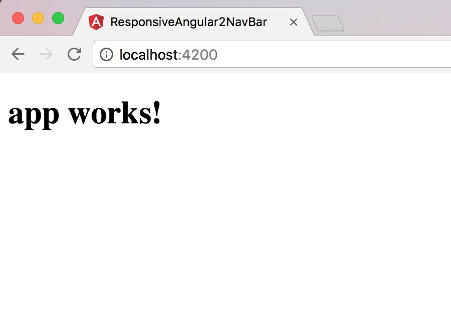

Esta es la forma más rápida para poner generar un proyecto que funciona inmediatamente y que sigue las mejore practicas dictadas por Angular. Con solo instalar algunos paquetes y correr unas lineas de comando usted podrá tener su primer proyecto de Angular funcionando en los próximos minutos. 

# Es más rapido con Angular-cli

Normalmente iniciar un proyecto en angular es un proceso lento y tiene una variedad de opciones que pueden tornar un poco confuso y tedioso el inicio de un proyecto a un usuario principiante. Pero en este post voy a presentar como iniciar con Angular de la manera más rápida usando angular-cli

## Instalando Angular-cli

 Primero es necesario instalar Node 6.9.0 o superior, junto con NPM 3 o superior

**1 - Node** (Un entorno de ejecución para JavaScript)

>La forma más rápida de instalar node es descargando el instalador según el sistema operativo que se este usando desde la pagina oficial  [Descargar Node](https://nodejs.org/es/download/)

**2 - NPM** (El manejador de paquetes para JavaScript) 
>Node viene con una version de npm, y con el siguiente comando se puede actualizar 


npm install npm@latest -g


Para revisar la versión de NPM que se esta usando se puede usar 


npm -v


**3 - angular-cli** (Command Line Interface para Angular)
>se instala corriendo la siguiente linea de comando


npm install -g @angular/cli


## Generar un proyecto en 2 lineas

Una vez que se tiene instalado @angular/cli se puede generar un proyecto con solo ubicarse en la carpeta donde se quiere generar y corriendo los siguientes comandos 


ng new PROJECT_NAME
cd PROJECT_NAME


## Ver el projecto localmente

Ahora para poder ver el proyecto funcionando solo hace falta correr la linea de comando 


ng serve


Y listo, ahora desde la dirección [http://localhost:4200](http://localhost:4200) se puede ver el proyecto funcionando.

