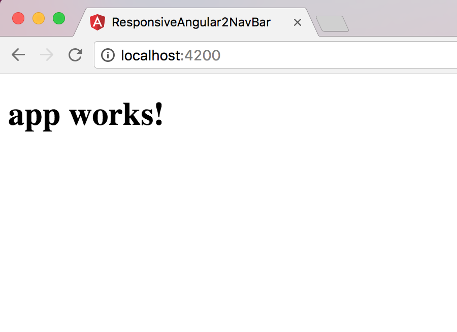

Esta es la forma más rápida para generar un proyecto que funcione inmediatamente y que ademas siga las mejore practicas dictadas por los creadores de Angular. Con esta técnica usted solo tiene que instalar algunos paquetes, correr unos cuantos comandos y usted podrá tener su primer proyecto de Angular funcionando en los próximos minutos. 

# Es más rapido con Angular-Cli

Normalmente iniciar un proyecto en Angular es un proceso lento y tiene una variedad de opciones que pueden tornar un poco confuso y tedioso el inicio de un proyecto a un usuario principiante. Pero en este post voy a presentar como iniciar con Angular de la manera más rápida, usando Angular-Cli.

## Instalando Angular-Cli 

1 - Primero es necesario instalar Node (Un entorno de ejecución para JavaScript) y NPM (Un manejador de paquetes para JavaScript).

**1 - Instalando Node**

La forma más rápida de instalar node es descargando y ejecutando el archivo correspondiente a su sistema operativo desde la pagina oficial. Para hacer esta descarga usted puede dirigirse al siguiente link. 

[Descargar Node](https://nodejs.org/es/download/)

**2 - Instalando NPM**

Node ya viene con una version de NPM, ahora solo hace falta que usted lo actualize corriendo el siguiente comando.


npm install npm@latest -g


Si usted quiere puede revisar la versión de NPM que usted tiene instalada con el comando


npm -v


2- Y finalmente usted va a instalar Angular-Cli corriendo este comando


npm install -g @angular/cli


## Generar un proyecto

Lo que tiene que hacer para generar el proyecto, es dirigirse al folder donde lo quiere crear en su computadora y correr las siguientes lineas.


ng new PROJECT_NAME
cd PROJECT_NAME


la descarga de los paquetes necesarios para este proyecto iniciará automáticamente. Este proceso puede tardar varios minutos. 

## Poner el proyecto a funcionar

Su proyecto ya esta listo y creado dentro de la carpeta generada. Ahora entre a la carpeta nueva de su proyecto y corra el comando.


ng serve


Y listo su primer proyecto en Angular 4 ya está funcionando, para poderlo ver abra un explorador web y vaya a la dirección web [localhost:4200](http://localhost:4200/). Su nuevo proyecto ser verá de la siguiente forma. 

